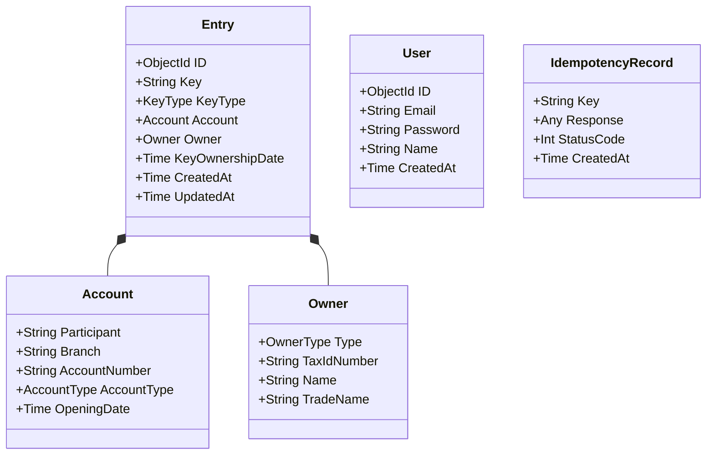

# Pix DICT Simulator (Go)

A high-performance Go implementation of the **Directory of Transactional Identifiers (DICT)**, simulating the core engine behind the Brazilian Pix ecosystem.

## Features

- **Fast Key Lookups:** MongoDB Single Field Indexing for sub-second responses
- **Idempotency:** `X-Idempotency-Key` header support for safe retries
- **Validation:** Módulo 11 for CPF/CNPJ, regex for Email/Phone, UUID v4 for EVP
- **Observability:** OpenTelemetry integration with Jaeger
- **Authentication:** JWT-based authentication with bcrypt password hashing
- **Rate Limiting:** Token bucket algorithm using Redis
- **Type Safety:** Strongly typed Go structs

## Tech Stack

- **Runtime:** Go 1.25+
- **HTTP Server:** `net/http` (standard library)
- **Database:** MongoDB via `go.mongodb.org/mongo-driver`
- **Cache:** Redis via `github.com/redis/go-redis/v9`
- **Auth:** JWT via `github.com/golang-jwt/jwt/v5`
- **Password Hashing:** bcrypt via `golang.org/x/crypto/bcrypt`
- **Observability:**
  - Tracing: `otelhttp`, `otelmongo`, `redisotel` (OpenTelemetry Contrib)
  - Logging: `otelzap` bridge with `zap`
  - Metrics: Prometheus client

## Quick Start

### With Docker

```bash
docker-compose up --build
```

Services available:

- **API:** http://localhost:3000
- **Jaeger UI:** http://localhost:16686

### Local Development

```bash
# Start MongoDB, Redis, and Jaeger (required)
docker run -d -p 27017:27017 mongo:7.0
docker run -d -p 6379:6379 redis:7.2-alpine
docker run -d -p 16686:16686 -p 4318:4318 -e COLLECTOR_OTLP_ENABLED=true jaegertracing/jaeger:2.6.0

# Set environment variables
export JWT_SECRET=your-secret-key

# Run the server
go run ./cmd/server
```

## API Endpoints

### Authentication

#### Register

```bash
curl -X POST http://localhost:3000/auth/register \
  -H "Content-Type: application/json" \
  -d '{
    "email": "user@example.com",
    "password": "password123",
    "name": "John Doe"
  }'
```

#### Login

```bash
curl -X POST http://localhost:3000/auth/login \
  -H "Content-Type: application/json" \
  -d '{
    "email": "user@example.com",
    "password": "password123"
  }'
```

### Entries (Requires Authentication)

#### Create Entry

```bash
curl -X POST http://localhost:3000/entries \
  -H "Content-Type: application/json" \
  -H "Authorization: <your-jwt-token>" \
  -H "X-Idempotency-Key: unique-request-id" \
  -d '{
    "key": "12345678909",
    "keyType": "CPF",
    "account": {
      "participant": "12345678",
      "branch": "0001",
      "accountNumber": "123456",
      "accountType": "CACC",
      "openingDate": "2024-01-15T00:00:00Z"
    },
    "owner": {
      "type": "NATURAL_PERSON",
      "taxIdNumber": "12345678909",
      "name": "John Doe"
    },
    "reason": "USER_REQUESTED",
    "requestId": "unique-request-uuid"
  }'
```

#### Get Entry

```bash
curl http://localhost:3000/entries/12345678909 \
  -H "Authorization: <your-jwt-token>"
```

#### Delete Entry

Per DICT specification, delete uses POST with a request body:

```bash
curl -X POST http://localhost:3000/entries/12345678909/delete \
  -H "Content-Type: application/json" \
  -H "Authorization: <your-jwt-token>" \
  -d '{
    "key": "12345678909",
    "participant": "12345678",
    "reason": "USER_REQUESTED"
  }'
```

Valid reasons: `USER_REQUESTED`, `ACCOUNT_CLOSURE`, `BRANCH_TRANSFER`, `RECONCILIATION`, `FRAUD`

### Health Check

```bash
curl http://localhost:3000/health
```

## API Response Format

All API responses follow a consistent DICT-compliant format:

```json
{
  "responseTime": "2026-01-14T10:00:00.000Z",
  "correlationId": "550e8400-e29b-41d4-a716-446655440000",
  "data": { ... }
}
```

| Field           | Description                                                            |
| --------------- | ---------------------------------------------------------------------- |
| `responseTime`  | ISO 8601 timestamp of when the response was generated                  |
| `correlationId` | UUID from `X-Correlation-Id` header, or auto-generated if not provided |
| `data`          | The actual response payload                                            |
| `error`         | Error code (only on errors)                                            |
| `message`       | Human-readable error message (only on errors)                          |

### Correlation ID

Pass `X-Correlation-Id` header to trace requests across systems:

```bash
curl http://localhost:3000/entries/12345678909 \
  -H "Authorization: <your-jwt-token>" \
  -H "X-Correlation-Id: my-trace-id-123"
```

## Key Types

| Type  | Format         | Validation                |
| ----- | -------------- | ------------------------- |
| CPF   | 11 digits      | Módulo 11                 |
| CNPJ  | 14 digits      | Módulo 11                 |
| EMAIL | RFC 5322       | Regex (max 77 chars)      |
| PHONE | +55XXXXXXXXXXX | +55 prefix + 10-11 digits |
| EVP   | UUID v4        | UUID format               |

## Data Modeling

The application uses MongoDB to store directory entries, users, and idempotency records.



## Application Flow

### Create Entry Flow

This diagram illustrates the processing of a key creation request (`POST /entries`), highlighting the middleware chain and business logic.


## Environment Variables

| Variable                    | Default                         | Description                   |
| --------------------------- | ------------------------------- | ----------------------------- |
| PORT                        | 3000                            | Server port                   |
| MONGODB_URI                 | mongodb://localhost:27017/dict  | MongoDB connection string     |
| REDIS_URI                   | redis://localhost:6379          | Redis connection string       |
| JWT_SECRET                  | (required)                      | Secret key for JWT signing    |
| OTEL_EXPORTER_OTLP_ENDPOINT | http://localhost:4318/v1/traces | OpenTelemetry Traces endpoint |
| RATE_LIMIT_BUCKET_SIZE      | 60                              | Max requests per window       |
| RATE_LIMIT_REFILL_SECONDS   | 60                              | Rate limit window in seconds  |

## Development

```bash
# Build
go build -o server ./cmd/server

# Run unit tests
go test ./internal/modules/... ./internal/ratelimit/...

# Run integration tests (requires Docker)
go test -v ./internal/integration/... -timeout 120s

# Run all tests
go test ./...

# Format code
go fmt ./...
```

## Testing

### Unit Tests

Unit tests cover validators, rate limiting logic, and handler behavior:

```bash
go test -v ./internal/modules/... ./internal/ratelimit/...
```

### Integration Tests

Integration tests use [testcontainers-go](https://golang.testcontainers.org/) to spin up real MongoDB and Redis containers. They test:

- CRUD operations on entries
- Key validation (CPF, CNPJ, Email, Phone, EVP)
- Idempotency behavior
- Correlation ID handling
- Authorization checks
- Rate limiting headers

```bash
# Requires Docker running
go test -v ./internal/integration/... -timeout 120s
```

### Load Tests (k6)

Performance tests using [k6](https://k6.io/):

```bash
# Start the server first
docker-compose up -d

# Run load tests
k6 run k6/entries.test.js
k6 run k6/idempotency.test.js
k6 run k6/stress.test.js
```

## License

MIT
